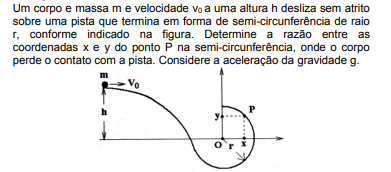

# sixth_quest
Programa que resolva a sexta questão da última avaliação de Física do primeiro ano EM do CAp.

## Ideia
Este algoritmo é baseado no método de Monte-Carlo para calcular a área do arco descrito no problema, em seguida é feita uma regra de três para descobrir o valor do ângulo.

## Monte-Carlo
Esse método descreve um algoritmo randômico, onde coordenadas são sorteadas e dependendo de suas posições podemos calcular o valor da área de uma figura.

## Problema
